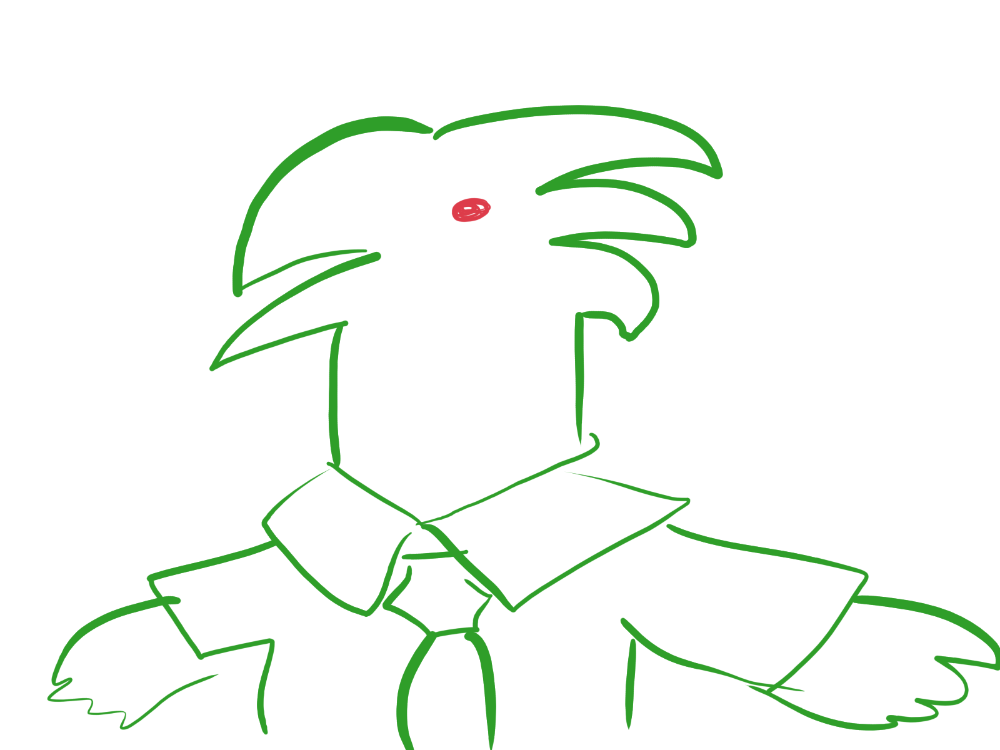

# Welcome to my webpage.

I'm Tyler. I am a student currently studying at the University of California, San Diego, and study Computer Science. I enjoy studying theoretical computer science and designing things. I'm also currently researching quantum computing in the context of quantum speedups and quantum problems. In my free time, I also like designing things. Most recently I've been having fun playing with the game *Minecraft* and its command blocks, which are pretty powerful these days (I might even call it a programming language of its own). Exploiting a game's systems and min-maxing is how I play games for fun (perhaps controversial statement).

## Programming Experience
- **Java**
- C++
- Python
- C
- x86 MASM Assembly
- Javascript
- ~~HTML, CSS~~

### Obligatory random quote, I guess
My friend in aerospace engineering says this about programming:
> Programming is not fun, and I hate it. I only do it because I need to.


### My most recent program (which I just wrote)
```
public class HelloWorld {
    public static void main(String[] args) {
        System.out.println("Hello World!");
    }
}

```

Tasks for this lab:
- [x] Part 1
- [x] Part 2
- [x] Part 3

Here's a random picture.


Here's another (I drew this one in 5 mins):



[License for this project](./LICENSE)

This site was made using [Github Pages](https://pages.github.com)


